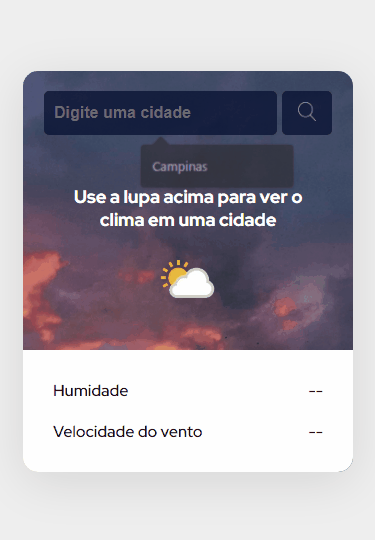

# Projeto Climatempo

Este projeto foi desenvolvido com o <a href="https://github.com/devemdobro">Dev em Dobro</a> no dia 22/11/2023 com o objetivo de fazer um projeto 'amigavél' as pessoas que nunca tiveram contato com programação WEB (HTML, CSS e JS).

## Screenshots



## Como rodar o projeto

Clone o repositório
```bash
git clone https://github.com/GuhLoyola/projeto-climatempo.git
```

Instalar as dependências
```bash
npm install
```

Execute a aplicação
```bash
npm start
```
## Links

<ul>
  <li>Live site URL: <a href='https://projeto-climatempo.vercel.app/' target=_blank>https://projeto-climatempo.vercel.app/</a></li>
  <li>Documentação da API: <a href='https://www.weatherapi.com/' target=_blank>Weather API</a></li>
  <li>Perfil do Dev em Dobro: <a href='https://github.com/devemdobro' target+_blank'>@devemdobro</a></li>
</ul>

## Tecnologias usadas

<ul>
  <li></li>
  <li></li>
  <li></li>
  <li></li>
</ul>

## Considerações finais

O projeto foi feito no React, mesmo com os gêmeos do Deve em dobro fazendo em JS puro eu quis me desafiar um pouco, coisa que não me arrependo de tentar fazer pois foi muito bom para treinar as habilidades que eu tenho.
